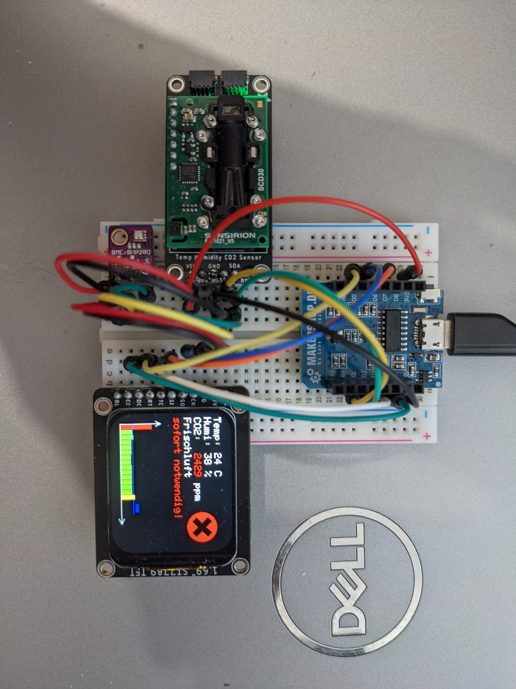
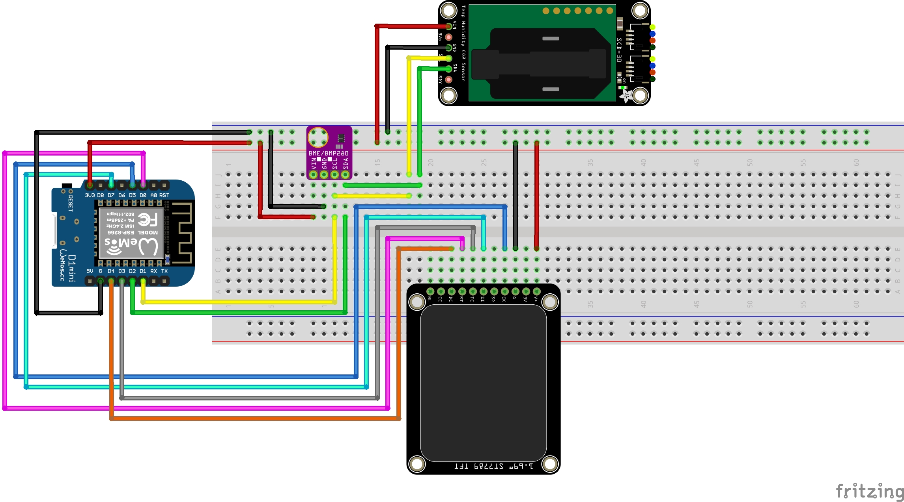

# DIY-CO2-Ampel - German
Dies ist die Erweiterung der [DIY CO2-Ampel mit dem MH-Z19C](https://www.blog.berrybase.de/blog/2021/02/16/diy-co2-ampel-mit-dem-mh-z19c/) des Autors [Maik Rygiel](https://www.blog.berrybase.de/blog/author/maik-rygiel/).
## Benötigte Hardware
Die hier verwendete Hardware für das Projekt:
- [x] D1 Mini
- [x] BME 280
- [X] Adafruit SCD-30 - NDIR CO2 Temperatur- und Feuchtigkeits-Sensor 
- [X] Adafruit 1,69 Zoll 280×240 abgerundetes rechteckiges Farb IPS TFT Display 
- [X] Dupont Kabel
- [X]  Breadboard mit 400 Kontakten

## Software
Für das Projekt wird die [Arduino IDE](https://www.arduino.cc/en/software) in der aktuellen Version und folgende Bibliotheken samt Abhängigkeiten benötigt:
- [x]	Adafruit SCD30 
- [x] Adafruit ST7735 and ST7789 Library
- [x]	Adafruit Zero DMA
- [x]	Adafruit SPIFlash
- [x]	SdFat - Adafruit Fork
- [x]	Adafruit_BME280_Library

## Verdrahtung
Im folgenden der kurze Zusammenbau der Schaltung

## Software auf den D1 Mini flashen
Kopieren Sie dieses Repository und extrahieren Sie die zip an einen Ort auf ihrem PC. Öffnen Sie danach im Ordner CO2-Warner die
gleichnamige CO2-Warner.ino-Datei. Die bitmap.h muss ebenfalls im gleichen Verzeichnis bleiben.

# DIY-CO2-Warner - English
This is the extension of the [DIY CO2 traffic light with the MH-Z19C](https://www.blog.berrybase.de/blog/2021/02/16/diy-co2-ampel-mit-dem-mh-z19c/) by the author [Maik Rygiel](https://www.blog.berrybase.de/blog/author/maik-rygiel/).
## Hardware needed
The hardware used here for the project:
- [x] D1 Mini
- [x] BME 280
- [X] Adafruit SCD-30 - NDIR CO2 temperature and humidity sensor 
- [X] Adafruit 1.69 inch 280×240 rounded rectangular color IPS TFT display 
- [X] Dupont cable
- [X] Breadboard with 400 contacts

## Software
The project requires the [Arduino IDE](https://www.arduino.cc/en/software) in the current version and the following libraries including dependencies:
- [x] Adafruit SCD30 
- [x] Adafruit ST7735 and ST7789 Library
- [x] Adafruit Zero DMA
- [x] Adafruit SPIFlash
- [x] SdFat - Adafruit Fork
- [x] Adafruit_BME280_Library

## Wiring
In the following the short assembly of the circuit

## Flashing the software to the D1 Mini
Copy this repository and extract the zip to a location on your PC. After that open in the folder CO2-Warner the
CO2-Warner.ino file with the same name. The bitmap.h must also remain in the same directory.
